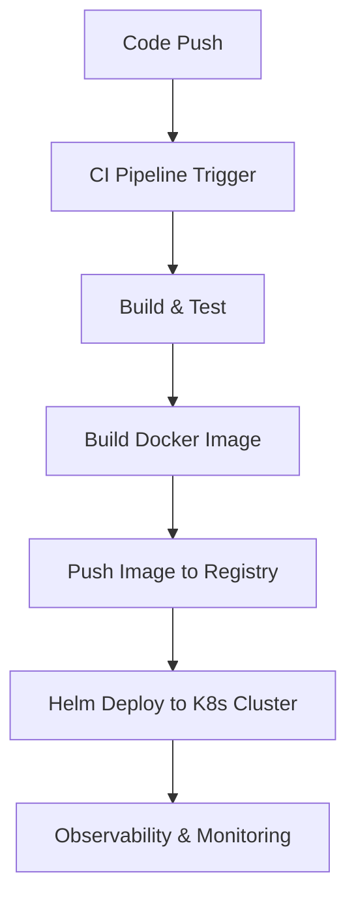

# Implementing CI/CD and Helm for Cloud-Native Application Deployment

## Introduction

In today's fast-paced software development world, Continuous Integration and Continuous Deployment (CI/CD) pipelines have become essential to delivering reliable, high-quality applications rapidly. When combined with Helm, the Kubernetes package manager, teams can automate and streamline deployment processes, enabling cloud-native applications to scale effortlessly.

This article explores how CI/CD pipelines and Helm charts integrate to create robust, repeatable deployments for modern microservices architectures.

---

## Why CI/CD Matters

CI/CD automates the build, testing, and deployment phases, bringing several advantages:

- **Accelerated release cycles:** New features and fixes reach production faster.
- **Improved code quality:** Automated tests run with every change, catching issues early.
- **Reduced manual errors:** Automation decreases human mistakes in deployment steps.
- **Safer deployments:** Rollbacks and canary releases can be implemented confidently.

---

## Helm: The Kubernetes Package Manager

Deploying complex applications on Kubernetes manually can be error-prone and time-consuming. Helm simplifies this by:

- Packaging applications and dependencies into reusable **charts**.
- Managing versioning and upgrades easily.
- Supporting rollback to previous versions if deployments fail.
- Abstracting complex Kubernetes manifests into manageable templates.

---

## Building a CI/CD Pipeline with GitLab

A typical pipeline involves these stages:

1. **Code Commit:** Developers push code changes to the GitLab repository.
2. **Build & Test:** CI jobs compile the code, run unit and integration tests.
3. **Containerization:** The application is packaged into Docker images.
4. **Image Push:** Docker images are pushed to a private container registry.
5. **Deployment:** Helm charts deploy or upgrade the application on Kubernetes.
6. **Verification:** Monitoring tools check the health of deployed services.

---

## Example Workflow

This workflow ensures that each code change automatically propagates through build, test, and deployment, with immediate feedback and visibility.

---

## Challenges & Solutions

- **Secrets Management:** Use Kubernetes Secrets or HashiCorp Vault to securely handle credentials.
- **Multi-Service Dependencies:** Define clear Helm chart dependencies and deployment order.
- **Idempotent Deployments:** Helm charts must be designed to handle repeated installs and upgrades without failures.

---

## Conclusion

By integrating CI/CD pipelines with Helm, organizations can realize faster delivery cycles and greater deployment consistency. This foundation, paired with an observability stack (such as OpenTelemetry and Prometheus), ensures applications are not only delivered swiftly but monitored proactively, a hallmark of production-grade cloud-native systems.

---

## Further Reading

- [GitLab CI/CD Documentation](https://docs.gitlab.com/ee/ci/)
- [Helm Official Site](https://helm.sh/)
- [Kubernetes Best Practices](https://kubernetes.io/docs/concepts/cluster-administration/manage-deployment/)
- [OpenTelemetry](https://opentelemetry.io/)

---

If you have questions about implementing this workflow or want to discuss custom solutions, feel free to [contact me](mailto:info.cideveloper@gmail.com).
